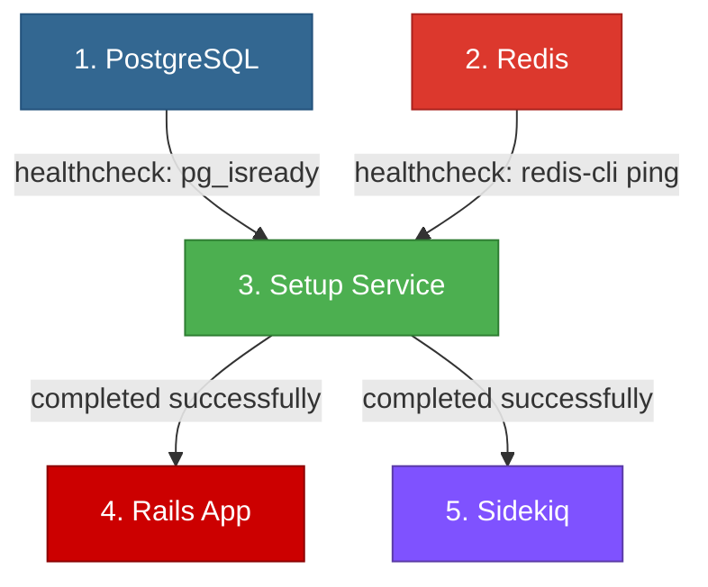

# ChatGon - Secuencia de Servicios (Actualizado)

## ✅ Cambios Realizados

Se ha reestructurado el `docker-compose.production.yaml` para incluir un **servicio dedicado de setup** que configura migraciones y Brand ANTES de que Rails y Sidekiq inicien.

---

## 📊 Arquitectura de Servicios

### Orden de Ejecución Garantizado



---

## 🔧 Servicios Configurados

### 1. PostgreSQL
**Archivo**: `docker-compose.production.yaml:191-205`

```yaml
postgres:
  image: pgvector/pgvector:pg16
  healthcheck:
    test: ["CMD-SHELL", "pg_isready -U ${POSTGRES_USERNAME:-postgres}"]
    interval: 10s
    timeout: 5s
    retries: 5
```

**Estado**: Servicio persistente (siempre corriendo)

---

### 2. Redis
**Archivo**: `docker-compose.production.yaml:207-223`

```yaml
redis:
  image: redis:7-alpine
  healthcheck:
    test: ["CMD", "redis-cli", "ping"]
    interval: 10s
    timeout: 5s
    retries: 5
```

**Estado**: Servicio persistente (siempre corriendo)

---

### 3. Setup Service (NUEVO)
**Archivo**: `docker-compose.production.yaml:14-58`
**Entrypoint**: `docker/entrypoints/setup.sh`

```yaml
setup:
  depends_on:
    postgres:
      condition: service_healthy
    redis:
      condition: service_healthy
  entrypoint: /usr/local/entrypoints/setup.sh
  restart: on-failure
```

**Tareas ejecutadas**:
1. ✅ Espera postgres y redis HEALTHY
2. ✅ Ejecuta `bundle exec rails db:prepare`
   - Crea base de datos si no existe
   - Ejecuta migraciones pendientes
   - Carga schema
3. ✅ Ejecuta `bundle exec rails runner bin/setup_brand.rb`
   - Configura INSTALLATION_NAME = ChatGon
   - Configura BRAND_NAME = ChatGon
   - Aplica logos personalizados
   - Establece DEPLOYMENT_ENV = self-hosted
   - Establece INSTALLATION_PRICING_PLAN = enterprise
   - Habilita TODAS las features
   - Aplica configuración de seguridad
4. ✅ Crea archivo marker: `/tmp/chatgon-setup-complete`
5. ✅ Termina exitosamente

**Estado**: Servicio de inicialización (se ejecuta y termina)

**Logs esperados**:
```
========================================
ChatGon Setup: Migrations & Brand Config
========================================
✓ PostgreSQL is ready
✓ Redis is ready
✓ Gems installed
========================================
Running database migrations...
========================================
✓ Database migrations completed successfully
========================================
Configuring ChatGon Brand...
========================================
✓ Updated INSTALLATION_NAME to ChatGon
✓ Updated BRAND_NAME to ChatGon
✓ Updated LOGO to /brand-assets/logo-cg.svg
✓ Enabled 50+ features
✓ Security: ENABLE_ACCOUNT_SIGNUP = false
✓ Brand configuration completed successfully
========================================
✓ ChatGon Setup Completed Successfully
========================================
Setup service completed. Ready for Rails and Sidekiq to start.
```

---

### 4. Rails App
**Archivo**: `docker-compose.production.yaml:60-146`
**Entrypoint**: `docker/entrypoints/rails.sh` (modificado)

```yaml
rails:
  depends_on:
    postgres:
      condition: service_healthy
    redis:
      condition: service_healthy
    setup:
      condition: service_completed_successfully  # ← NUEVO
  command: ['bundle', 'exec', 'rails', 's', '-p', '3000', '-b', '0.0.0.0']
```

**Cambios en el entrypoint**:
- ✅ Espera archivo marker `/tmp/chatgon-setup-complete`
- ✅ NO ejecuta migraciones (ya las ejecutó setup)
- ✅ NO ejecuta setup_brand (ya lo ejecutó setup)
- ✅ Solo inicia el servidor Rails

**Estado**: Servicio persistente (siempre corriendo)

**Logs esperados**:
```
Waiting for ChatGon setup service to complete...
✓ Setup service completed. Starting Rails server...
✓ Rails server started on port 3000
```

---

### 5. Sidekiq
**Archivo**: `docker-compose.production.yaml:148-189`

```yaml
sidekiq:
  depends_on:
    postgres:
      condition: service_healthy
    redis:
      condition: service_healthy
    setup:
      condition: service_completed_successfully  # ← NUEVO
  command: ['bundle', 'exec', 'sidekiq', '-C', 'config/sidekiq.yml']
```

**Estado**: Servicio persistente (siempre corriendo)

---

## 🎯 Ventajas de esta Arquitectura

### 1. Separación de Responsabilidades
- **Setup**: Inicialización (migraciones + Brand)
- **Rails**: Servidor web
- **Sidekiq**: Trabajos en background

### 2. Orden Garantizado
- Rails y Sidekiq **NUNCA** inician antes de que setup termine
- Usa `service_completed_successfully` de Docker Compose

### 3. Logs Claros
- Cada servicio tiene logs separados en Coolify
- Fácil identificar dónde ocurren errores

### 4. Idempotencia
- Setup puede re-ejecutarse sin problemas
- Usa `restart: on-failure` para reintentos automáticos

### 5. Sin Condiciones de Carrera
- Rails y Sidekiq siempre encuentran:
  - ✅ Base de datos migrada
  - ✅ Brand configurado
  - ✅ Features habilitadas
  - ✅ Configuración de seguridad aplicada

---

## 📁 Archivos Creados/Modificados

### Nuevos Archivos

1. **`docker/entrypoints/setup.sh`**
   - Entrypoint del servicio setup
   - Ejecuta migraciones y Brand setup
   - Crea marker file

### Archivos Modificados

2. **`docker-compose.production.yaml`**
   - Agregado servicio `setup`
   - Rails depende de `setup` (service_completed_successfully)
   - Sidekiq depende de `setup` (service_completed_successfully)

3. **`docker/entrypoints/rails.sh`**
   - Espera marker file en producción
   - NO ejecuta migraciones en producción
   - NO ejecuta setup_brand en producción

4. **`DESPLIEGUE-DESDE-CERO.md`**
   - Actualizada secuencia con servicio setup
   - Logs esperados de cada servicio

5. **`DEPLOY-COOLIFY.md`**
   - Actualizada secuencia de inicialización
   - Comandos para ver logs de setup

---

## 🚀 Cómo Funciona en Coolify

### Al Hacer Deploy

1. Coolify inicia los servicios según `depends_on`
2. **PostgreSQL** inicia primero
3. **Redis** inicia segundo
4. **Setup** espera a que postgres y redis estén healthy
5. Setup ejecuta migraciones y Brand setup
6. Setup crea marker file y termina
7. **Rails** espera marker file y luego inicia
8. **Sidekiq** espera marker file y luego inicia

### En los Logs de Coolify

Verás 5 contenedores:
- `chatgon-postgres-1` (corriendo)
- `chatgon-redis-1` (corriendo)
- `chatgon-setup-1` (exited 0) ← Terminó exitosamente
- `chatgon-rails-1` (corriendo)
- `chatgon-sidekiq-1` (corriendo)

---

## 🔍 Verificación

### Ver logs del setup
```bash
docker logs chatgon-setup-1
```

### Verificar que setup terminó correctamente
```bash
docker ps -a | grep setup
# Debe mostrar "Exited (0)" si fue exitoso
```

### Ver marker file en Rails
```bash
docker exec chatgon-rails-1 ls -la /tmp/chatgon-setup-complete
```

### Verificar Brand en base de datos
```bash
docker exec chatgon-rails-1 bundle exec rails runner \
  "puts InstallationConfig.find_by(name: 'BRAND_NAME').value"
# Output: ChatGon
```

---

## ⚙️ Comandos Útiles

### Re-ejecutar setup manualmente
```bash
docker-compose run --rm setup
```

### Ver todos los servicios
```bash
docker-compose ps
```

### Reiniciar solo Rails
```bash
docker-compose restart rails
```

### Ver logs en tiempo real
```bash
# Setup
docker logs -f chatgon-setup-1

# Rails
docker logs -f chatgon-rails-1

# Sidekiq
docker logs -f chatgon-sidekiq-1
```

---

## ✅ Checklist de Despliegue Exitoso

- [ ] PostgreSQL corriendo y healthy
- [ ] Redis corriendo y healthy
- [ ] Setup completado exitosamente (exited 0)
- [ ] Logs de setup muestran "✓ ChatGon Setup Completed Successfully"
- [ ] Rails corriendo en puerto 3000
- [ ] Sidekiq corriendo y procesando jobs
- [ ] Brand visible en la aplicación
- [ ] No hay warnings de premium features

---

**ChatGon** - Configuración profesional con servicios dedicados
**Versión**: 2.0 (con servicio setup dedicado)
**Fecha**: 2025-10-06
